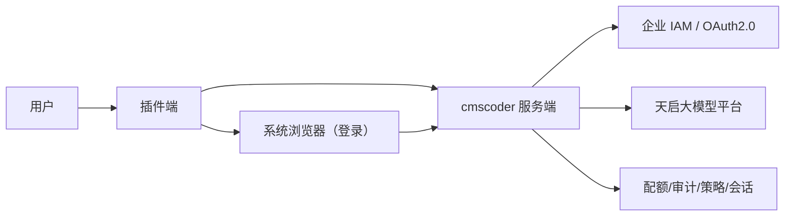

# cmscoder 总体 Spec

## 1. 文档目的

本文档用于定义 **cmscoder** 的建设目标、系统边界、核心能力、架构分工、接口原则与实施路线，作为后续产品设计、技术方案、研发拆分、项目管理和验收评估的统一依据。

## 2. 名词定义

### 2.1 cmscoder

基于 Claude Code、OpenCode 等 Coding Agent 的企业级 Harness 系统，包含：

- **Coding Agent**：直接使用企业推荐的 Claude Code、OpenCode 版本
- **插件端**：用户本地安装的插件或适配组件，直接与 Coding Agent 集成，并承担用户接入、企业能力接入、工作流增强、权限控制、上下文治理、工具编排、体验承载等核心职责
- **服务端**：cmscoder 的后端服务，负责身份校验、模型接入、协议适配、额度治理、审计与策略执行等能力

### 2.2 插件端

用户本地运行的组件，负责：

- 本地接入 Claude Code / OpenCode
- 登录与本地会话维护
- 本地配置注入
- Agent 工作流增强
- 工具、权限、上下文前置控制
- 与服务端交互

### 2.3 服务端

cmscoder 的后端系统，负责：

- 用户身份校验
- 用户配置存储
- 会话管理
- 配额、限流、审计、策略治理
- Coding Agent 模型统一接入，并使用系统级凭证访问上游天启大模型平台

### 2.4 公司天启大模型平台

本项目上游系统，提供标准大模型 API 接口，并向 cmscoder 服务端提供一个 **系统级 Key**，用于实际模型调用。

### 2.5 公司 IAM

本项目上游系统，公司现有身份认证系统，提供标准 OAuth2.0 / SSO 能力。

## 3. 系统定位

### 3.1 核心定位

cmscoder 是位于 **Coding Agent（Claude Code / OpenCode）** 与 **天启大模型平台** 之间的一层企业级 Harness。

其目标不是简单转发模型请求，而是提供一套完整的：

- Agent Harness 能力
- 工具和上下文治理能力
- 企业身份接入能力
- 模型访问统一能力
- 企业级控制与审计能力

### 3.2 一句话描述

cmscoder 通过插件端将 Claude Code / OpenCode 接入企业研发环境，通过服务端统一承接认证、模型访问与治理能力，使用户仅通过企业身份登录即可使用 Coding Agent，并提供额外的企业级 Agent Harness 能力。

## 4. 建设目标

### 4.1 业务目标

1. 支持标准 Coding Agent，目前支持 Claude Code 与 OpenCode，并为后续扩展其他 Agent 预留空间。
2. 提供 Coding Agent 的企业级使用体验与研发工作流能力。
3. 统一企业内 Coding Agent 的接入方式，用户登录后免配置，配置在服务端保存。
4. 将模型接入、鉴权、额度、策略、审计统一收敛到服务端。

### 4.2 技术目标

1. 建立一套统一的本地插件架构，兼容多种 Coding Agent。
2. 建立一套统一的服务端模型接入与治理能力。
3. 形成插件端与服务端之间清晰的职责边界。
4. 支持企业 IAM 登录与较长时间会话续期。
5. 支持对上游天启大模型平台的标准化调用与协议转换。
6. 为后续接入 MCP、企业工具、审批、审计、策略中心等能力预留扩展点。

## 5. 设计原则

### 5.1 插件端优先

插件端是核心交互层和主要能力承载层，应优先建设插件端架构、能力框架和可扩展机制，而不是把系统价值仅理解为服务端网关。

### 5.2 用户无感底层模型

用户只感知企业登录与模型能力，不需要管理 OpenAI、Anthropic 等底层厂商的 API Key、endpoint 或协议差异。

### 5.3 服务端统一治理

所有涉及以下事项的能力都在服务端统一完成：

- 模型访问控制
- 系统级密钥管理
- 协议适配
- 审计与策略

### 5.4 多 Agent 兼容

插件端能力设计应抽象出公共层，避免把能力写死在某一个 Agent 生态中。

### 5.5 渐进演进

第一阶段优先打通登录、配置接入、统一模型访问和基础治理；后续再逐步增强工具治理、上下文工程、企业流程编排等高级能力。

## 6. 系统范围

### 6.1 In Scope

#### 插件端

- Claude Code / OpenCode 适配
- 本地登录与会话管理
- 服务端连接配置
- 模型访问入口重定向
- Agent 启动与会话初始化增强
- 工具调用前置检查
- 上下文与提示增强
- 工作流引导与企业规范注入
- 插件能力开关与配置同步
- 本地状态展示

#### 服务端

- OAuth2.0 登录态校验
- 会话与 token 管理
- 模型访问统一入口
- 对上游天启大模型平台的协议适配
- 使用系统级 Key 调用上游模型平台
- 模型路由与模型白名单
- 用户、团队、项目级额度控制
- 审计日志
- 请求追踪与异常处理

### 6.2 Out of Scope

- 自研基础大模型
- 替代上游天启大模型平台
- 全量企业工具平台建设
- 完整审批或风控平台
- 完整 IDE 产品替代
- 全自动无人值守研发流程

## 7. 总体架构

### 7.1 架构解释

#### 用户侧

用户通过 Claude Code / OpenCode 使用 cmscoder 插件端。

#### 插件端

负责接入 Agent、本地能力增强、登录与会话、本地配置与工作流控制。登录时通过系统浏览器访问服务端代理入口完成 IAM 认证。

#### 服务端

负责身份与会话校验、模型访问、治理与审计。

#### 天启大模型平台

提供标准模型 API，由服务端持系统级 Key 调用。

## 8. 关键职责划分

### 8.1 插件端职责

插件端是系统的核心承载层，应至少包括以下职责：

#### 8.1.1 Agent 适配层

- 适配 Claude Code
- 适配 OpenCode
- 对不同 Agent 的配置方式、模型接入方式、上下文注入方式做兼容封装

#### 8.1.2 登录与会话层

- 检测登录状态
- 发起 SSO 登录
- 动态分配本地回环端口并启动短生命周期 HTTP 服务
- 唤起系统默认浏览器访问服务端代理登录入口
- 接收回调
- 安全保存本地登录信息
- 支持长会话，例如 7 天免重复登录
- 静默续期
- 注销与会话清理

#### 8.1.3 模型接入配置层

- 将 Agent 的模型调用目标重定向到 cmscoder 服务端
- 屏蔽用户对底层模型厂商 API Key 的感知
- 管理本地 endpoint、token helper 或 provider 配置
- 处理服务端返回的模型列表、默认模型等信息

#### 8.1.4 会话初始化增强层

- 在 Agent 启动时注入企业上下文
- 注入研发规范、工程约束、默认提示、项目级知识
- 建立统一的会话启动流程

#### 8.1.5 工作流增强层

- 对规划、设计、编码、测试、Review 等阶段进行引导
- 提供企业级 skills、commands、预置 agent 角色
- 强化研发流程一致性
- 承载 Harness Engineering 的工作流逻辑

#### 8.1.6 工具治理层

- 对本地工具调用进行前置检查
- 按策略决定 allow / ask / deny
- 对高风险操作进行提醒或阻断
- 可扩展接入 Bash、文件写入、代码修改、测试执行等工具管控

#### 8.1.7 上下文治理层

- 管理初始上下文注入
- 管理长期上下文保存与压缩
- 管理项目上下文、团队规范、系统提示增强
- 降低上下文污染和提示漂移

#### 8.1.8 本地体验层

- 展示登录状态
- 展示当前用户、租户、项目
- 展示可用模型与默认模型
- 展示额度摘要与异常状态
- 提供诊断与修复入口

#### 8.1.9 配置与扩展层

- 统一管理本地配置
- 支持插件功能开关
- 支持多项目、多环境配置
- 预留未来扩展企业工具、MCP、审批、知识库等能力

### 8.2 服务端职责

#### 8.2.1 身份校验

- 校验插件端传来的登录态或访问 token
- 识别用户、租户、项目、角色
- 作为 IAM 白名单回调方完成 state 校验、code 换 token 与用户信息查询

#### 8.2.2 会话管理

- 维护用户会话
- 签发和刷新 cmscoder 自有会话或 JWT
- 支持 token 刷新
- 管理会话有效期
- 支持注销与失效控制

#### 8.2.3 模型统一接入

- 作为插件端的统一模型访问入口
- 对外提供兼容 Claude Code / OpenCode 的模型 API 入口
- 对内转发至上游天启大模型平台

#### 8.2.4 协议转换

- 处理 OpenAI 风格、Claude 风格或统一企业风格的请求协议
- 映射模型 ID
- 统一错误码
- 统一 usage 和 tracing 元数据

#### 8.2.5 模型路由

- 根据用户、团队、项目、策略选择模型
- 支持默认模型配置
- 支持模型白名单与熔断

#### 8.2.6 系统级凭证管理

- 安全保存调用上游天启大模型平台所需的系统级 Key
- 插件端与用户不可见、不可获取该 Key

#### 8.2.7 配额与限流

- 用户维度额度控制
- 团队维度额度控制
- 项目维度预算控制
- RPM、TPM、并发数限制

#### 8.2.8 审计与可观测

- 记录请求日志
- 记录模型使用量
- 记录错误与异常
- 记录 request id / trace id
- 支持后续对接审计系统

## 9. 关键系统边界

### 9.1 插件端不负责的事情

- 不保存上游天启大模型平台系统级 Key
- 不直接调用上游天启大模型平台
- 不承担配额、审计、预算等企业治理主逻辑
- 不直接做复杂的模型协议适配

### 9.2 服务端不负责的事情

- 不直接替代本地插件的交互职责
- 不直接承载本地工作流体验
- 不替代 Agent 本身的交互与工具系统

### 9.3 天启大模型平台不负责的事情

- 不识别终端用户身份
- 不识别插件端登录态
- 不面向最终用户直接提供接入
- 不承担企业级 Agent 的本地集成逻辑

## 10. 插件端核心能力模型

为避免“插件端只是登录壳子”的误解，建议明确插件端的核心能力树：

### 10.1 基础接入能力

- Agent 适配
- 登录认证
- 本地会话
- 配置注入

### 10.2 Agent 增强能力

- 会话启动增强
- 提示增强
- 预置 skills、commands、agents
- 项目规范注入

### 10.3 研发流程能力

- 任务分解
- 设计评审引导
- 测试与代码检查引导
- Review 工作流
- 发布与收尾流程

### 10.4 风险控制能力

- 高危命令识别
- 写文件或执行命令前置检查
- 权限确认
- 未来接入审批能力

### 10.5 本地观测能力

- 登录态可见
- 模型可见
- 配额可见
- 错误可诊断

## 11. 典型用户链路

### 11.1 首次使用

1. 用户安装插件端。
2. 插件端检测到未登录。
3. 插件端启动本地临时回环服务并唤起系统浏览器访问 cmscoder 服务端登录入口。
4. 服务端通过 Proxy Callback 模式与 IAM 完成授权码登录、用户信息查询，并签发 cmscoder 会话凭证。
5. 浏览器回跳到插件提供的 `http://127.0.0.1:<port>/callback`，插件保存本地会话。
6. 同步服务器配置；如果无配置，则设置为默认策略，并将 Claude Code / OpenCode 配置为通过 cmscoder 服务端访问模型。
7. 用户开始正常使用 Coding Agent。

### 11.2 日常使用

1. 用户打开 Claude Code / OpenCode。
2. 插件端检查本地会话。
3. 若会话有效，则自动恢复服务端访问能力。
4. 用户直接使用 Agent，无需再次输入模型 API Key。
5. 所有模型请求均通过服务端转发至天启大模型平台。

### 11.3 会话过期

1. 插件端发现短时访问 token 过期。
2. 若本地登录会话仍有效，则静默刷新。
3. 若本地登录会话已失效，则提示重新登录。

## 12. 协议与接口原则

### 12.1 对插件端的原则

- 插件端只访问 cmscoder 服务端，不直接访问天启大模型平台
- 插件端只保存用户登录态和服务端访问所需会话，不保存系统级模型 Key
- 插件端通过本地回环服务接收登录结果，不直接持有 IAM `client_secret`
- 插件端应尽量将底层模型协议差异屏蔽掉

### 12.2 对服务端的原则

- 服务端对插件端暴露统一模型访问接口
- 服务端作为 IAM 代理回调方承接 OAuth 2.0 授权码模式
- 服务端对上游天启大模型平台执行协议转换
- 服务端统一补充系统级鉴权信息

### 12.3 对天启大模型平台的原则

- 仅接受来自 cmscoder 服务端的系统级调用
- 不直接面向插件端暴露

### 12.4 地址约定

- `http://127.0.0.1:<port>`：插件端提供的本地回环地址
- `<cmscoder-backend>`：cmscoder 服务端地址
- `<iam>`：IAM 系统地址

## 13. 非功能要求

### 13.1 安全性

- 本地登录信息必须安全存储
- 系统级 Key 仅服务端持有
- 插件端不得泄露上游模型访问密钥
- 服务端需具备基础审计与追踪能力

### 13.2 可扩展性

- 新增 Agent 适配应尽量不影响公共能力层
- 新增模型平台应尽量通过服务端路由与适配实现
- 新增工具治理能力应尽量以插件端扩展点承载

### 13.3 可观测性

- 登录、请求、错误、限流、额度消耗均需可追踪
- 插件端要具备基础诊断能力
- 服务端要具备完整日志和 tracing 能力

### 13.4 可维护性

- 插件端与服务端边界清晰
- 配置项统一
- 接口语义稳定
- 支持灰度与版本演进

## 14. MVP 建设范围建议

### 14.1 插件端 MVP

- Claude Code / OpenCode 双适配
- IAM 登录闭环：本地回环服务、浏览器唤起、回调接收与安全存储
- 服务端 endpoint 配置注入
- 默认模型接入
- 启动时登录检查
- 基础状态展示
- 基础会话增强

### 14.2 服务端 MVP

- IAM 代理登录网关与回调闭环
- 短时 token 签发
- 模型统一入口
- 对上游天启大模型平台的协议适配
- 系统级 Key 管理
- 基础配额与审计

### 14.3 非 MVP

- 复杂策略引擎
- 高危审批流
- MCP 工具平台
- 企业知识平台深度集成
- 自动化全链路研发编排

## 15. 阶段演进建议

### 阶段一：接入打通

目标：可登录、可用、可统一访问模型。

推荐优先级：

1. 先完成插件端与服务端的基础能力，包括工程骨架、配置、日志、基础状态、通用适配层。
2. 基础能力完成后，首个主要功能是 IAM 登录闭环，采用 OAuth 2.0 授权码模式加服务端 Proxy Callback。
3. IAM 登录闭环稳定后，再进入统一模型访问与基础治理联调。

### 阶段二：插件增强

目标：增强工作流、上下文、工具前置控制。

### 阶段三：企业治理增强

目标：完善额度、审计、限流、模型策略与可观测。

### 阶段四：高级 Harness 能力

目标：逐步接入企业工具、流程编排、审批、知识与治理体系。

## 16. 成功标准

### 用户侧

- 用户仅通过企业账号登录即可使用 Coding Agent
- 用户无需配置具体模型 API Key
- 用户使用 Claude Code / OpenCode 的体验基本一致

### 平台侧

- 模型访问统一走 cmscoder 服务端
- 服务端统一持有系统级 Key
- 能按用户、团队、项目查看调用与消耗

### 工程侧

- 插件端具备可扩展的能力框架，而非单一登录壳
- 服务端具备稳定的模型适配与治理能力
- 系统架构可支持后续企业级扩展

## 17. 当前阶段的结论

1. cmscoder 的核心不是“做一个登录代理”。
2. 登录只是插件端中的一个基础模块。
3. 插件端应被定位为企业级 Agent Harness 的核心承载体。
4. 服务端应被定位为统一模型访问与企业治理控制面。
5. 天启大模型平台是上游模型能力提供方，由服务端持系统级 Key 统一接入。

## 18. 专题拆分索引

建议基于本总纲维护以下专项文档：

1. [整体开发计划](../project/development-plan.md)
2. [已完成功能](../project/completed-features.md)
3. [插件端总体架构设计](../plugin/plugin-architecture.md)
4. [服务端总体架构设计](../web-server/server-architecture.md)
5. [Claude Code 适配方案](../plugin/claude-code-adapter.md)
6. [OpenCode 适配方案](../plugin/opencode-adapter.md)
7. [IAM 认证与会话管理设计](../user-service/iam-auth-session.md)
8. [模型接入与协议转换设计](./model-access-protocol.md)
9. [插件端工作流增强设计](../plugin/plugin-workflow-enhancement.md)
10. [工具治理与权限控制设计](../plugin/tool-governance-permission-control.md)
11. [配额、审计与可观测设计](./quota-audit-observability.md)
12. [项目里程碑与研发拆分计划](../project/roadmap-and-delivery-plan.md)
13. [插件端外部依赖与交互清单](../plugin/plugin-external-dependencies.md)
