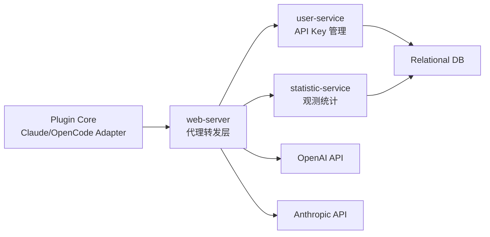
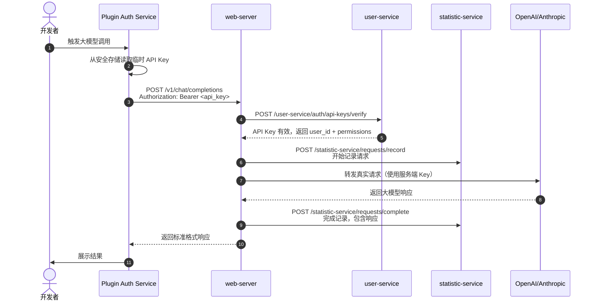
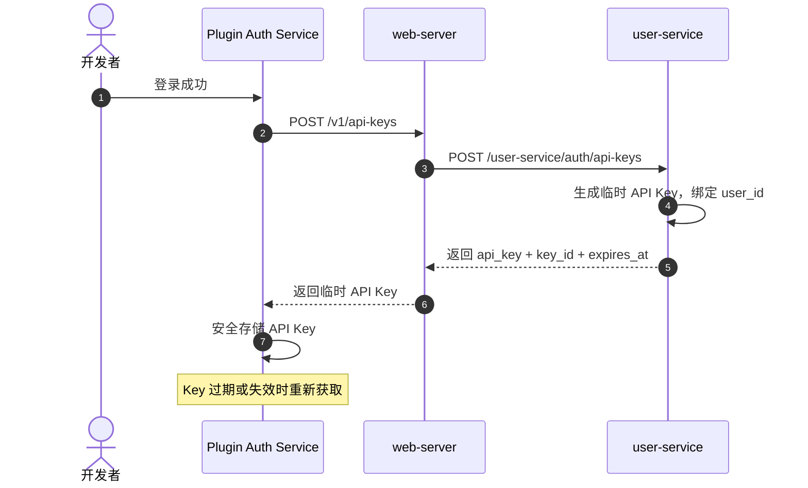
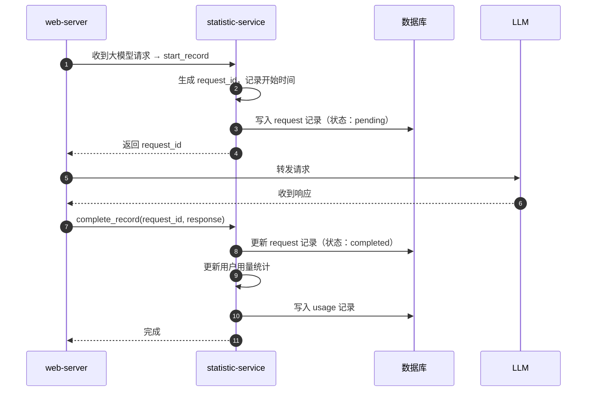

# 大模型代理与 API Key 管理设计

## 1. 文档目标

定义 cmscoder 的企业级大模型代理、API Key 管理、统计观测能力。本文档为实现企业级管控奠定基础。

**关键约束：用户不直接持有第三方大模型 Key，所有请求通过 cmscoder 代理，使用临时生成的用户绑定 API Key 进行身份标识**。

## 2. 关联文档

- 总纲：[cmscoder-overview.md](./cmscoder-overview.md)
- 插件端依赖：[../plugin/plugin-external-dependencies.md](../plugin/plugin-external-dependencies.md)
- web-server 架构：[../web-server/server-architecture.md](../web-server/server-architecture.md)
- 认证与会话：[../user-service/iam-auth-session.md](../user-service/iam-auth-session.md)
- 项目里程碑：[../project/roadmap-and-delivery-plan.md](../project/roadmap-and-delivery-plan.md)

## 3. 设计范围

### 3.1 In Scope

- web-server 代理 OpenAI 和 Anthropic 标准接口
- user-service 管理与用户绑定的临时 API Key（生成、验证、撤销）
- 新增 statistic-service 完成观测功能（请求记录、用量统计、异常检测）
- 插件端使用临时 API Key 访问代理接口
- 企业级管控能力：用户级权限控制、用量限制、审计日志
- 插件端唯一性验证：设备指纹 + 实例绑定 + 请求签名

### 3.2 Out of Scope

- 基于内容的访问控制、敏感信息过滤
- 多模型提供商智能路由、负载均衡
- 成本中心和预算管理的完整实现
- AI 治理和合规性检查

## 4. 关键场景或流程

### 4.1 方案结论

采用「分层职责、统一代理、全链路观测」的方案：

核心设计原则：
- **分层职责**：web-server 负责代理转发，user-service 负责 API Key 管理，statistic-service 负责观测
- **临时绑定**：API Key 与登录用户绑定，临时生成且有过期时间，不暴露第三方 Key
- **全链路观测**：所有大模型请求经过代理层，完整记录请求响应，支持后续分析和管控

### 4.2 服务拓扑



结论：
- **web-server** 是唯一对外暴露的大模型代理入口，提供 OpenAI 和 Anthropic 标准接口
- **user-service** 管理与用户身份绑定的临时 API Key，不对外暴露第三方 Key
- **statistic-service** 独立负责观测功能，记录请求、统计用量、检测异常
- 插件端使用临时 API Key 访问 web-server，不需要用户填写任何 Key

### 4.3 大模型调用主流程



### 4.4 API Key 生命周期流程



### 4.5 运行场景

| 场景 | 触发方式 | 职责 |
|------|---------|------|
| 首次获取 API Key | 登录成功后自动触发 | user-service 生成 Key，插件端存储 |
| 使用临时 Key 调用 | 插件端每次大模型请求 | web-server 验证 Key，转发请求 |
| API Key 过期 | Key 超过 TTL 或主动撤销 | 插件端自动重新获取新 Key |
| 用量统计查询 | 管理员或用户主动查询 | statistic-service 聚合数据并返回 |
| 异常检测告警 | 检测到异常模式 | statistic-service 触发告警 |

### 4.6 观测数据流程



## 5. 设计要点

### 5.1 web-server 职责（代理转发）

- 实现 OpenAI 标准接口：`/v1/chat/completions`、`/v1/models` 等
- 实现 Anthropic 标准接口：`/v1/messages` 等
- API Key 验证（调用 user-service）
- 插件端唯一性验证（设备指纹 + 实例绑定 + 请求签名）
- 请求转发与响应处理
- 调用 statistic-service 记录请求和响应
- 不持有真实第三方 Key（由配置管理）
- 限流、超时、重试控制

### 5.2 user-service 职责（API Key 管理）

- 生成与用户身份绑定的临时 API Key（格式：`cmsc-<random>`）
- API Key 验证与权限检查
- API Key 撤销与失效控制
- API Key 生命周期管理（过期时间、轮换策略）
- 存储 API Key 的哈希值（不存储明文）
- 关联 user_id、权限配置、使用限制
- 管理插件实例与用户的绑定关系

### 5.3 statistic-service 职责（观测统计）

- 记录所有大模型请求和响应（request/response 完整记录）
- 用户级别用量统计（token 使用量、请求次数、费用估算）
- 模型级别使用分析（模型偏好、性能指标）
- 异常检测（异常请求模式、潜在滥用识别）
- 审计日志（关键操作记录、可追溯性）
- 数据聚合与查询接口

### 5.4 插件端职责

- 登录成功后自动获取临时 API Key
- 安全存储 API Key（使用操作系统安全存储）
- 生成设备指纹和实例 ID
- 对请求进行签名，添加必要的请求头
- 使用临时 API Key 调用 web-server 代理接口
- 自动处理 API Key 过期（静默刷新）
- 配置代理接口地址和认证方式
- 不需要用户填写任何第三方 Key

### 5.5 插件端唯一性验证

#### 5.5.1 核心验证机制

采用「设备指纹 + 实例绑定 + 请求签名」的三层验证机制：

1. **设备指纹**：插件端基于操作系统信息、硬件信息、插件版本生成唯一指纹，使用 SHA-256 算法
2. **实例绑定**：插件首次启动时生成实例 ID（UUID），登录时与用户身份绑定
3. **请求签名**：每次请求携带签名，防止请求被伪造

#### 5.5.2 插件端实现

- **设备指纹生成**：`generateDeviceFingerprint()` 函数，收集系统信息并生成哈希
- **实例 ID 管理**：`getOrCreateInstanceId()` 函数，持久化存储实例 ID
- **请求签名**：使用 HMAC-SHA256 算法，对请求参数、时间戳、设备指纹进行签名
- **请求头标识**：
  - `X-CMSC-Plugin-Id`：插件实例 ID
  - `X-CMSC-Device-Fingerprint`：设备指纹
  - `X-CMSC-Timestamp`：请求时间戳
  - `X-CMSC-Signature`：请求签名
  - `X-CMSC-Plugin-Version`：插件版本

#### 5.5.3 服务端实现

- **实例绑定**：登录时记录插件实例 ID、设备指纹与用户的绑定关系
- **请求验证**：
  - 验证 API Key 有效性
  - 验证插件实例 ID 与用户的绑定关系
  - 验证设备指纹的合法性
  - 验证时间戳（防止重放攻击，时间窗口 5 分钟）
  - 验证请求签名
- **访问控制**：未携带插件标识的请求直接拒绝，标识验证失败的请求拒绝

#### 5.5.4 验证流程

1. **插件端初始化**：生成实例 ID 和设备指纹，存储到安全存储
2. **登录流程**：登录时将实例 ID 和设备指纹发送到服务端，服务端验证并绑定到用户账号
3. **请求流程**：
   - 准备请求：获取 API Key、实例 ID、设备指纹，生成时间戳
   - 生成签名：使用 HMAC-SHA256 对请求参数、时间戳、设备指纹进行签名
   - 发送请求：设置所有必要的请求头，发送请求到 web-server
   - 服务端验证：验证 API Key、实例绑定、时间戳、签名
   - 验证通过后转发请求到大模型

### 5.6 API Key 设计

| 属性 | 说明 | 建议值 |
|------|------|--------|
| 格式 | `cmsc-<random>` | 前缀 + 16-32 字符随机字符串 |
| TTL | 临时 Key 过期时间 | 7 天（可配置） |
| 存储 | 仅存储哈希值 | SHA-256 |
| 关联 | 绑定 user_id、权限、限制 | 用户级别粒度 |
| 状态 | active/inactive/revoked | 完整状态管理 |

### 5.7 核心安全约束

- **用户不持有第三方 Key**：真实 Key 只存在服务端配置中
- **临时绑定**：API Key 与登录用户绑定，有过期时间
- **完整记录**：所有大模型请求和响应都经过代理并记录
- **权限控制**：基于用户身份进行权限和用量限制
- **安全传输**：所有通信使用 HTTPS，敏感信息加密存储

### 5.8 数据模型设计

#### `api_key` 表（user-service）

| 字段 | 类型 | 说明 |
|------|------|------|
| key_id | string | API Key ID（主键） |
| user_id | string | 关联的用户 ID |
| api_key_hash | string | API Key 哈希值 |
| prefix | string | Key 前缀（用于识别） |
| expires_at | timestamp | 过期时间 |
| created_at | timestamp | 创建时间 |
| last_used_at | timestamp | 最后使用时间 |
| status | string | 状态（active/inactive/revoked） |
| permissions | json | 权限配置 |
| usage_limits | json | 用量限制配置 |

#### `llm_request` 表（statistic-service）

| 字段 | 类型 | 说明 |
|------|------|------|
| request_id | string | 请求 ID（主键） |
| user_id | string | 用户 ID |
| api_key_id | string | 使用的 API Key ID |
| model | string | 调用的模型 |
| provider | string | 提供商（openai/anthropic） |
| request_payload | json | 请求内容 |
| response_payload | json | 响应内容 |
| prompt_tokens | int | 输入 token 数 |
| completion_tokens | int | 输出 token 数 |
| total_tokens | int | 总 token 数 |
| estimated_cost | decimal | 估算费用 |
| latency_ms | int | 延迟（毫秒） |
| status | string | 状态（success/error） |
| error_message | string | 错误信息（如有） |
| created_at | timestamp | 请求时间 |

#### `user_usage` 表（statistic-service）

| 字段 | 类型 | 说明 |
|------|------|------|
| id | bigint | ID（主键） |
| user_id | string | 用户 ID |
| date | date | 日期 |
| model | string | 模型 |
| request_count | int | 请求次数 |
| prompt_tokens | bigint | 输入 token 累计 |
| completion_tokens | bigint | 输出 token 累计 |
| total_cost | decimal | 累计费用 |
| created_at | timestamp | 创建时间 |
| updated_at | timestamp | 更新时间 |

#### `plugin_instance` 表（user-service）

| 字段 | 类型 | 说明 |
|------|------|------|
| instance_id | string | 插件实例 ID（主键） |
| user_id | string | 关联的用户 ID |
| device_fingerprint | string | 设备指纹哈希 |
| plugin_version | string | 插件版本 |
| agent_type | string | 代理类型（claude-code/opencode） |
| last_active_at | timestamp | 最后活跃时间 |
| created_at | timestamp | 创建时间 |
| status | string | 状态（active/inactive） |

#### `api_key_instance` 表（user-service）

| 字段 | 类型 | 说明 |
|------|------|------|
| id | bigint | ID（主键） |
| api_key_id | string | API Key ID |
| instance_id | string | 插件实例 ID |
| created_at | timestamp | 创建时间 |

## 6. 接口、数据或配置

### 6.1 对插件暴露的 web-server API（代理接口）

| 端点 | 方法 | 说明 |
|------|------|------|
| `/v1/chat/completions` | POST | OpenAI 聊天完成接口 |
| `/v1/models` | GET | OpenAI 模型列表 |
| `/v1/messages` | POST | Anthropic 消息接口 |
| `/v1/api-keys` | POST | 生成临时 API Key（需认证） |
| `/v1/api-keys` | GET | 获取当前用户的 API Key 列表 |
| `/v1/api-keys/{keyId}` | DELETE | 撤销 API Key |

#### 6.1.1 `POST /v1/chat/completions`（OpenAI 兼容）

**认证**：`Authorization: Bearer <api_key>`

入参：标准 OpenAI 请求格式

出参：标准 OpenAI 响应格式

#### 6.1.2 `POST /v1/messages`（Anthropic 兼容）

**认证**：`Authorization: Bearer <api_key>`

入参：标准 Anthropic 请求格式

出参：标准 Anthropic 响应格式

#### 6.1.3 `POST /v1/api-keys`（生成临时 Key）

**认证**：`Authorization: Bearer <access_token>`（使用登录后的 access_token）

入参：
```json
{
  "ttl": 604800,
  "description": "string"
}
```

出参：
```json
{
  "apiKey": "cmsc-xxxxx",
  "keyId": "string",
  "expiresAt": "2024-01-01T00:00:00Z"
}
```

### 6.2 web-server 内部 API

| 端点 | 方法 | 说明 |
|------|------|------|
| `/user-service/auth/api-keys` | POST | 生成临时 API Key |
| `/user-service/auth/api-keys/verify` | POST | 验证 API Key |
| `/user-service/auth/api-keys/{keyId}` | DELETE | 撤销 API Key |
| `/statistic-service/requests/record` | POST | 开始记录请求 |
| `/statistic-service/requests/complete` | POST | 完成记录请求 |
| `/statistic-service/usage/{userId}` | GET | 查询用户用量 |
| `/statistic-service/requests` | GET | 查询请求列表 |

#### 6.2.1 `POST /user-service/auth/api-keys/verify`

入参：
```json
{
  "apiKey": "string"
}
```

出参：
```json
{
  "valid": true,
  "userId": "string",
  "permissions": {},
  "usageLimits": {}
}
```

### 6.3 配置设计

#### web-server `config.toml`

```toml
[llm]
# OpenAI 配置
[llm.openai]
apiKey = "sk-xxxxx"
baseUrl = "https://api.openai.com"
enabled = true

# Anthropic 配置
[llm.anthropic]
apiKey = "sk-ant-xxxxx"
baseUrl = "https://api.anthropic.com"
enabled = true

# 代理配置
[proxy]
timeout = 60
retryCount = 3
retryDelay = 1

# statistic-service 配置
[statistic]
baseUrl = "http://statistic-service:8080"
enabled = true
```

#### user-service `config.toml`（已有，新增）

```toml
[apiKey]
ttl = 604800
prefix = "cmsc-"
keyLength = 32
```

### 6.4 后端目录建议

```
cmscoder-server/
  web-server/
    api/
      llm/              # 新增：大模型代理接口
        v1/
          chat_completions.go
          models.go
          messages.go
      api-keys/         # 新增：API Key 管理接口
        v1/
          api_keys.go
    internal/
      controller/
        llm/            # 新增：大模型代理控制器
        api-keys/       # 新增：API Key 控制器
      clients/
        statistic-client/  # 新增：statistic-service 客户端

  user-service/
    api/
      auth/
        v1/
          auth_api_keys.go  # 新增：API Key 管理接口
          auth_plugin_instance.go  # 新增：插件实例管理接口
    internal/
      service/
        apikey/            # 新增：API Key 服务
        plugin/            # 新增：插件实例服务
      repository/
        apikey_repo.go      # 新增：API Key 仓储
        plugin_instance_repo.go  # 新增：插件实例仓储

  statistic-service/       # 新增：统计观测服务
    api/
      requests/
        v1/
          record.go
          complete.go
          list.go
      usage/
        v1/
          query.go
          aggregate.go
    internal/
      service/
        request/
        usage/
        anomaly/
      repository/
        llm_request_repo.go
        user_usage_repo.go
```

## 7. 非功能要求

| 维度 | 要求 |
|------|------|
| 安全性 | API Key 哈希存储、第三方 Key 不暴露、HTTPS 传输、权限验证 |
| 可用性 | 代理层超时控制、重试机制、熔断降级、多提供商 fallback |
| 可观测性 | 完整请求记录、用户级别统计、异常检测告警、审计日志 |
| 性能 | 请求记录异步处理、缓存常用数据、查询接口分页 |
| 兼容性 | 完全兼容 OpenAI 和 Anthropic 标准接口，插件端无需修改 |

## 8. 风险与待确认

- 大模型 API 响应大小限制和处理策略
- 请求记录的存储成本和数据保留策略
- 异常检测的规则和阈值配置
- 统计数据的聚合粒度和查询性能
- 多模型提供商的计费模型和成本估算
- statistic-service 的部署架构和扩展性

## 9. 验收标准

- 插件端不需要用户填写任何第三方 Key 即可使用大模型
- 所有大模型请求经过 web-server 代理并完整记录
- API Key 与用户身份绑定，有过期时间和撤销机制
- statistic-service 可以查询用户级别的用量统计
- 支持 OpenAI 和 Anthropic 标准接口，插件端无缝切换
- 代理层性能可接受，延迟增加小于 100ms
- 安全措施到位，无第三方 Key 泄露风险