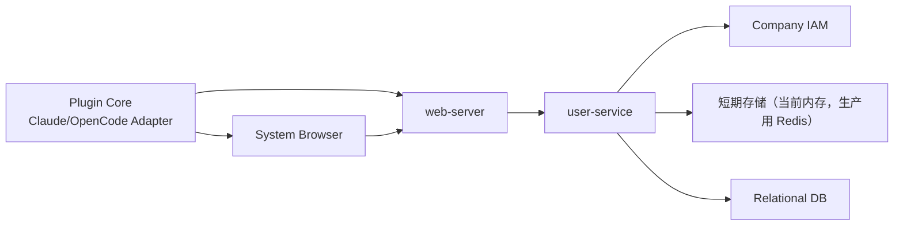
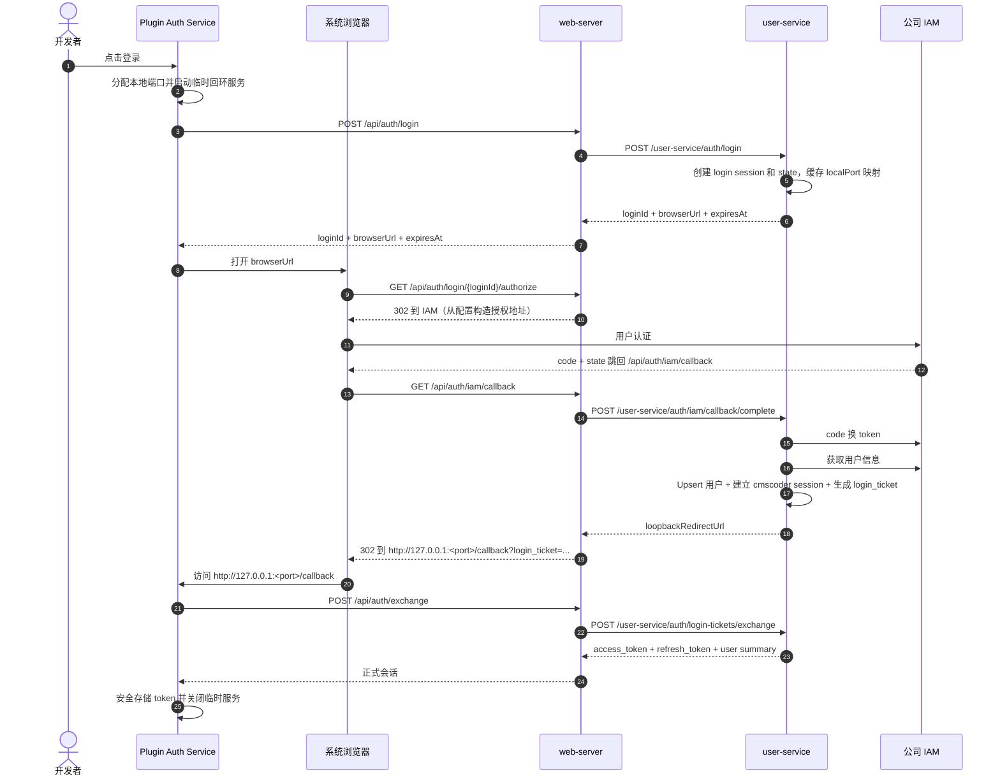

# IAM 认证与会话管理设计

## 1. 文档目标

定义 cmscoder 的企业 IAM 登录、user-service 认证核心逻辑、token 管理与续期机制。本文档为 user-service 的认证能力规范。

**关键约束：浏览器回跳到本地回环地址时只携带一次性 `login_ticket`，不直接透传 cmscoder access token**，插件端再向 web-server 交换正式会话凭证。

## 2. 关联文档

- 总纲：[../shared/cmscoder-overview.md](../shared/cmscoder-overview.md)
- 插件端依赖：[../plugin/plugin-external-dependencies.md](../plugin/plugin-external-dependencies.md)
- web-server 架构：[../web-server/server-architecture.md](../web-server/server-architecture.md)
- 项目里程碑：[../project/roadmap-and-delivery-plan.md](../project/roadmap-and-delivery-plan.md)

## 3. 设计范围

### 3.1 In Scope

- IAM OAuth 2.0 登录接入、代理回调与登出
- 用户身份落库、组织映射和 session 签发
- 服务端用户会话与 token 刷新（含 refresh token 轮换）
- 静默续期、失效处理、注销清理
- 一次性 login_ticket 生成与交换
- 外部 API、内部 API、核心数据模型与状态存储

### 3.2 Out of Scope

- 模型网关、协议转换和模型路由的实现细节
- 插件端本地回环服务、浏览器唤起、安全存储（见插件端文档）
- IAM 应用申请、白名单开通和企业组织模型设计

## 4. 关键场景或流程

### 4.1 方案结论

登录链路采用 **OAuth 2.0 授权码模式（Authorization Code Grant）+ 服务端 Proxy Callback**。

核心原因：
- 插件端作为本地应用，无法稳定持有固定公网回调地址
- IAM 的 `redirect_uri` 需要满足白名单约束
- `client_secret` 不能泄露到插件端

### 4.2 服务拓扑



结论：
- 对外只有 `web-server` 暴露公网接口和浏览器回调地址
- `user-service` 只对内提供认证与会话能力，持有 IAM `client_secret`
- 插件端不引入独立守护进程，先采用"插件内公共层 + 短生命周期回环服务"

### 4.3 登录主流程



### 4.4 运行场景

| 场景 | 触发方式 | user-service 职责 |
|------|---------|------------------|
| 首次登录 | 用户点击登录按钮 | 创建 login session、IAM 回调、用户落库、签发 ticket |
| 会话恢复 | Agent 启动时 `ensureSession()` | introspect 验证 access token 有效性 |
| 静默续期 | 访问 token 过期，调 `POST /api/auth/refresh` | 刷新 token、轮换 refresh token、更新会话过期时间 |
| 刷新失败 | refresh_token 失效 | 返回错误码，插件端提示重新登录，不自动重试 |
| 用户注销 | 调用 `POST /api/auth/logout` | 撤销 refresh token、标记 session 失效 |
| IAM 统一登出 | IAM 主动发起下游统一登出 | 清理关联的所有有效会话 |

### 4.5 刷新流程

- 插件端通过 web-server 转发 `POST /api/auth/refresh`，web-server 仅做参数校验和 trace 透传
- user-service 负责刷新 token、轮换 refresh token、更新会话过期时间
- 刷新失败时返回明确错误码，由插件端决定后续行为

### 4.6 注销流程

- 插件端通过 web-server 转发 `POST /api/auth/logout`
- user-service 撤销 refresh token、标记 session 失效，并按需调用 IAM 单点登出接口

## 5. 设计要点

### 5.1 user-service 职责

- 持有 IAM 应用配置和 `client_secret`，负责所有 OAuth/SSO 交互
- 管理 `login session`、`state`、一次性 `login_ticket` 和用户正式会话
- 根据 IAM 用户信息完成用户落库、组织映射和 session 签发
- 提供 refresh token 轮换、会话注销、会话查询、设备维度 session 管理
- 输出统一认证错误码，供 web-server 和插件端做诊断展示

### 5.2 web-server 职责（认证相关）

- 作为唯一对外入口，负责统一路由、TLS 终止、trace id 注入和限流
- 暴露插件端使用的认证接口、浏览器授权入口和回调入口
- 对所有输入参数做边界校验，特别是 `localPort`、`agentType`、`pluginInstanceId`
- 对受保护接口做 access token 验签或向 `user-service` 做 session introspection
- 不保存 IAM `client_secret`，不拥有认证主状态机，不直接操作用户会话数据

### 5.3 IAM 职责

- 提供统一登录页面和身份验证能力
- 发放 OAuth 2.0 标准授权码与访问凭证
- 提供用户基础信息查询能力

### 5.4 不引入独立插件守护进程

Feature 1 不单独建设 `cmscoder-plugind`：
- 当前目标是先打通 SSO 闭环，独立守护进程会增加进程管理、升级和跨 Agent 共享状态的复杂度
- Claude Code 和 OpenCode 先通过共用 `plugin core` 复用同一套认证逻辑
- 若后续需要托管长期状态展示、系统托盘、统一诊断面板，再演进为本地守护进程

### 5.5 Token 与票据模型

| 票据 | 用途 | TTL | 存储 |
|------|------|-----|------|
| `login session` | 登录初始化时创建 | 5 分钟 | 内存（生产用 Redis） |
| `state` | 与 login session 绑定，防 CSRF | 同 login session | 内存（生产用 Redis） |
| `login_ticket` | 浏览器回跳携带的一次性票据 | 60 秒，消费后立即失效 | 内存（生产用 Redis） |
| `access_token` | 插件访问 web-server 的短期凭证 | 15 分钟 | 插件端内存 |
| `refresh_token` | 插件续期使用的长期凭证 | 7 天，每次刷新轮换 | 关系型数据库 |
| `session_id` | 服务端会话主键 | 绑定 refresh_token 生命周期 | 关系型数据库 |

### 5.6 核心设计约束

- 插件端保存用户登录态，不保存系统级模型 Key 或 IAM `client_secret`
- 服务端负责识别用户、租户、项目、角色
- 会话管理需要兼顾较长登录周期与短时访问凭证
- 登录失败、刷新失败、回调失败都需要可诊断

### 5.7 关键安全约束

- 浏览器回跳链路禁止直接透传 access token 或 refresh token
- `localPort` 只允许数字端口，回跳地址固定为 `http://127.0.0.1:<port>/callback`，禁止任意域名回跳
- `login_ticket` 必须一次性消费，并记录 `consumedAt` 以防重放
- 插件本地敏感信息优先使用操作系统安全存储
- 对 `POST /api/auth/login`、`POST /api/auth/exchange`、`POST /api/auth/refresh` 做基础频控和审计

## 6. 接口、数据或配置

### 6.1 对插件暴露的 web-server API

插件端通过 web-server 访问以下认证接口：

| 端点 | 方法 | 说明 |
|------|------|------|
| `/api/auth/login` | POST | 创建登录会话 |
| `/api/auth/login/{loginId}/authorize` | GET | 浏览器跳转 IAM（web-server 从配置构造地址） |
| `/api/auth/iam/callback` | GET | IAM 回调入口，跳转回本地回环地址 |
| `/api/auth/exchange` | POST | 用 login_ticket 交换正式会话凭证 |
| `/api/auth/refresh` | POST | 刷新 access token |
| `/api/auth/logout` | POST | 注销会话 |
| `/api/auth/me` | GET | 获取当前用户信息（需认证） |
| `/api/plugin/bootstrap` | GET | 插件引导信息 |

详细接口定义见下方 6.1.1 ~ 6.1.6。

#### 6.1.1 `POST /api/auth/login`

入参：

| 字段 | 类型 | 必填 | 说明 |
|------|------|------|------|
| localPort | int | 是 | 本地回环端口，≥ 1024 |
| agentType | string | 是 | 枚举：`claude-code`、`opencode` |
| pluginInstanceId | string | 是 | 插件实例唯一标识 |
| clientVersion | string | 否 | 客户端版本号 |

出参：

| 字段 | 类型 | 说明 |
|------|------|------|
| loginId | string | 登录会话 ID |
| browserUrl | string | 浏览器授权入口地址 |
| expiresAt | string | 会话过期时间 |

#### 6.1.2 `POST /api/auth/exchange`

入参：

| 字段 | 类型 | 必填 | 说明 |
|------|------|------|------|
| loginTicket | string | 是 | 一次性登录票据 |
| pluginInstanceId | string | 是 | 插件实例唯一标识 |

出参：

| 字段 | 类型 | 说明 |
|------|------|------|
| accessToken | string | 访问令牌 |
| refreshToken | string | 刷新令牌 |
| expiresIn | int64 | 过期时间（秒） |
| user | object | 用户摘要 |

#### 6.1.3 `POST /api/auth/refresh`

入参：

| 字段 | 类型 | 必填 | 说明 |
|------|------|------|------|
| refreshToken | string | 是 | 刷新令牌 |

出参：

| 字段 | 类型 | 说明 |
|------|------|------|
| accessToken | string | 新的访问令牌 |
| refreshToken | string | 新的刷新令牌（轮换） |
| expiresIn | int64 | 过期时间（秒） |

#### 6.1.4 `POST /api/auth/logout`

入参：`refreshToken` 或 `sessionId`（二选一）

#### 6.1.5 `GET /api/auth/me`

需携带 `Authorization: Bearer <access_token>`。

出参：当前用户摘要、租户、项目、session 过期时间。

#### 6.1.6 `GET /api/plugin/bootstrap`

出参：用户摘要、功能开关、默认模型、基础状态信息。

### 6.2 web-server 与 user-service 内部 API

| 端点 | 方法 | 说明 |
|------|------|------|
| `/user-service/auth/login` | POST | 创建 login session，返回 loginId + expiresAt |
| `/user-service/auth/iam/callback/complete` | POST | 完成 IAM 回调，返回 loopbackRedirectUrl |
| `/user-service/auth/login-tickets/exchange` | POST | 用 login_ticket 交换正式会话 |
| `/user-service/auth/sessions/refresh` | POST | 刷新会话 |
| `/user-service/auth/sessions/revoke` | POST | 撤销会话 |
| `/user-service/auth/sessions/introspect` | GET | 校验 access token 或返回 session 摘要 |

### 6.3 IAM 配置与接口

IAM 相关地址和凭证通过配置文件管理。**`client_secret` 仅存在于 user-service 的配置中**，web-server 只保留授权跳转所需的最小配置。

web-server `config.toml`：

```toml
[iam]
authorizeURL = "<iam>/idp/api/oauth2/authorize"
clientId     = "your-client-id"
redirectURI  = "https://<cmscoder-backend>/api/auth/iam/callback"
```

user-service `config.toml`：

```toml
[iam]
tokenURL     = "<iam>/idp/oauth2/getToken"
userInfoURL  = "<iam>/idp/oauth2/getUserInfo"
clientId     = "your-client-id"
clientSecret = "your-client-secret"
```

### 6.4 核心数据模型

#### 6.4.1 `login_session`（内存 / 生产用 Redis）

| 字段 | 说明 |
|------|------|
| loginId | 登录会话 ID |
| state | CSRF 防重放 |
| localPort | 插件本地回环端口 |
| agentType | 客户端类型 |
| pluginInstanceId | 插件实例 ID |
| status | 会话状态 |
| expiresAt | 过期时间 |

#### 6.4.2 `login_ticket`（内存 / 生产用 Redis）

| 字段 | 说明 |
|------|------|
| ticketId | 票据 ID |
| sessionId | 关联的 session ID |
| pluginInstanceId | 插件实例 ID |
| expiresAt | 过期时间 |
| consumedAt | 消费时间（一次性消费） |

#### 6.4.3 `user_identity`（关系型数据库）

| 字段 | 说明 |
|------|------|
| userId | 内部用户 ID |
| iamUserId | IAM 用户 ID |
| email | 邮箱 |
| displayName | 显示名称 |
| tenantId | 租户 ID |
| status | 用户状态 |

#### 6.4.4 `user_session`（关系型数据库）

| 字段 | 说明 |
|------|------|
| sessionId | 会话 ID |
| userId | 用户 ID |
| agentType | 客户端类型 |
| pluginInstanceId | 插件实例 ID |
| refreshTokenHash | 刷新令牌哈希 |
| issuedAt | 签发时间 |
| expiresAt | 过期时间 |
| revokedAt | 撤销时间 |

#### 6.4.5 `auth_audit_log`（日志系统 / 审计表）

| 字段 | 说明 |
|------|------|
| eventType | 事件类型 |
| userId | 用户 ID |
| sessionId | 会话 ID |
| traceId | 追踪 ID |
| result | 结果 |
| reason | 原因 |
| createdAt | 创建时间 |

### 6.5 后端目录建议

```
cmscoder-server/
  web-server/
    api/
      auth/
      plugin/
    middleware/
      tracing/
      auth/
      ratelimit/
    clients/
      user-service-client/

  user-service/
    application/
      login-session/
      iam/
      session/
      ticket/
      user-profile/
    infrastructure/
      cache/
      repository/
      iam-client/
      signer/
```

## 7. 非功能要求

| 维度 | 要求 |
|------|------|
| 安全性 | 本地敏感会话信息必须安全存储；`client_secret` 仅能存在于服务端；`state` 必须用于防 CSRF；`login_ticket` 必须短时有效、一次性消费 |
| 可用性 | `login session`、`login_ticket` 使用短期存储；user-service 对 IAM 调用要有超时、重试和熔断 |
| 可观测性 | 认证链路统一产出 `traceId`、`requestId`、`sessionId`，插件端记录可读错误码 |
| 兼容性 | Claude Code 与 OpenCode 必须共用一套 `plugin core`，差异只留在 adapter 层 |
| 可演进性 | 后续新增模型网关或策略服务时，只在 web-server 聚合，不把 IAM 职责扩散到其他服务 |

## 8. 风险与待确认

- IAM 的授权模式、回调限制和客户端形态需要按正式环境确认
- 本地安全存储方案依赖的操作系统能力待确认
- 多租户、多项目切换的会话模型待补充
- 插件端初始化 login session 的接口形态需与实际插件宿主能力对齐
- 本地回环端口冲突、浏览器拉起失败、重复登录并发需补充处理策略
- Claude Code 和 OpenCode 的启动钩子、配置写入点、状态展示能力是否足够统一
- 插件运行环境是否总能访问系统安全存储；若不能，开发环境回退策略需单独定义
- web-server 是否选择 JWT 本地验签，还是所有受保护请求都回源 user-service 做 introspection
- 多租户、多项目切换是否复用同一个 session，还是需要租户级子会话

## 9. 验收标准

- 用户可通过企业账号完成登录并在有效期内免重复登录
- 插件端可完成回环服务拉起、浏览器唤起、回调接收和安全存储
- 服务端可完成代理回调、login ticket 交换、用户信息查询和 cmscoder 会话签发
- 浏览器回跳链路不直接暴露 cmscoder access token
- token 过期时可静默刷新，失败时可明确提示重新登录
- 注销后本地与服务端会话均可清理
- `web-server` 成为唯一对外认证入口，`user-service` 不直接对插件暴露公网接口
- `user-service` 独立持有 IAM 集成、login session、ticket、session 和 refresh 逻辑
- Claude Code 与 OpenCode 插件共用一套认证公共层，仅 adapter 层处理差异
- SSO 登录成功后，插件端可直接拿到支撑后续模型访问的正式会话
